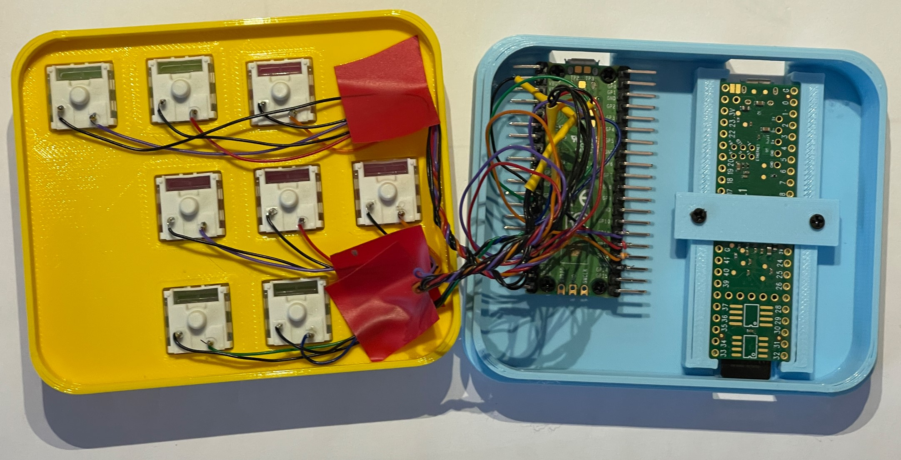

# USB Keyboard and case for Dirtywave M8 Headless


This is a little case for the wonderful [Dirtywave M8](http://www.dirtywave.com) headless device. It uses a Raspberry Pi Pico to simulate a 
USB keyboard and also serves as a case for the Teensy 4.1 that powers the whole system. The back has two holes for USB connectors. You just plug them both into your computer and you have the Teensy running and a clicky keyboard that works just like the real thing. 

There are 3D printable designs for the case. You can use Kailh Mechanical Keyboard Switches if you're not afraid to solder directly to the pins on the back. There are designs for just the keyboard Pico or both the Pico and the Teensy. 



I used wire wrap wires to connect the Pico to the switches. They are wire wrapped onto solder pins on the Pic and and then wire wrapped and soldered onto the switches. Not pretty, but this is only a problem if you let someone look inside. If anyone fancies making a PCB you have my full support :) 

```python
key_switches = [
        Switch(pin=board.GP18,name="up",ch=Keycode.UP_ARROW),      # up
        Switch(pin=board.GP19,name="option",ch=Keycode.Z),  # option
        Switch(pin=board.GP20,name="Edit",ch=Keycode.X),    # edit 
        Switch(pin=board.GP13,name="Left",ch=Keycode.LEFT_ARROW),    # left
        Switch(pin=board.GP12,name="down",ch=Keycode.DOWN_ARROW),    # down
        Switch(pin=board.GP11,name="right",ch=Keycode.RIGHT_ARROW),   # right
        Switch(pin=board.GP21,name="shift",ch=Keycode.LEFT_SHIFT),   # shift 
        Switch(pin=board.GP22,name="play",ch=Keycode.SPACEBAR)   # play
        ]
```

Above are the pin assignmnents I used for each key to GPIO pins on the Pico. All the switches should pull the input to ground. 

The Teensy is clamped inside the case. There are no connections to it. The idea is that we should get some airflow along the bottom of the case to keep it cool. 


The Pico is powered by a Circuit Python program that scans the switches and sends out keypresses. Load Circuit Python 7 onto the device, copy code.py onto the drive along with the contents of the lib folder and you should be good to go. 

Have fun

Rob Miles

http://www.robmiles.com
